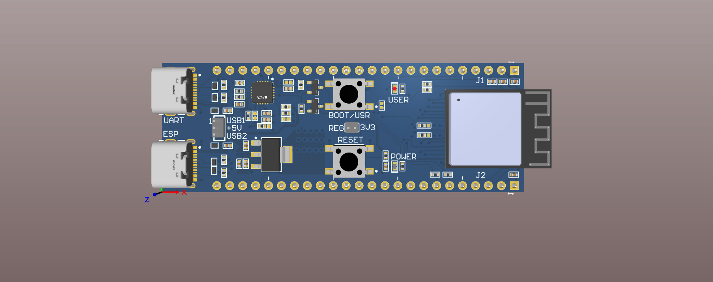
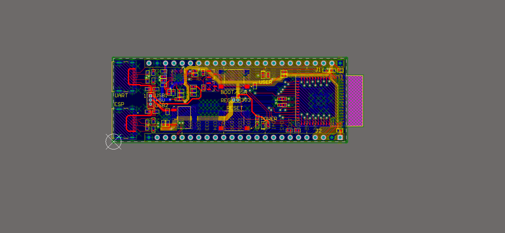
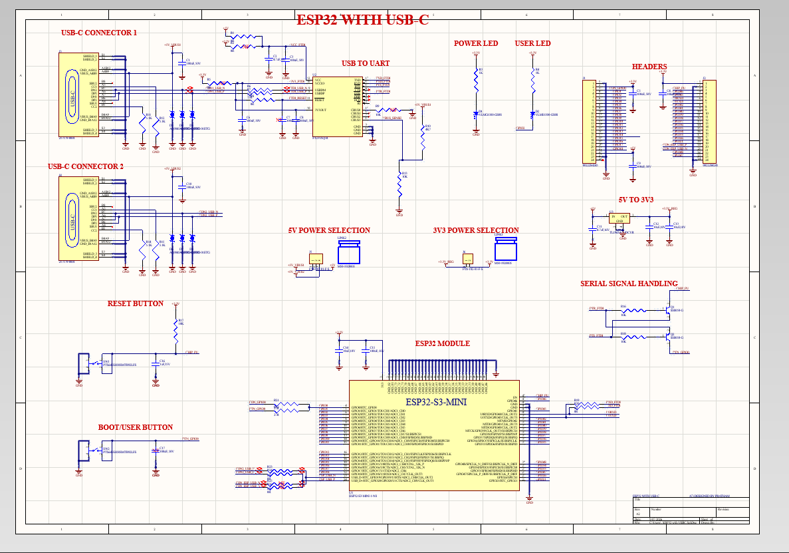

# ESP32-S3 Custom Development Board

A custom ESP32-S3 development board designed using Altium Designer, covering the complete process from schematic design to PCB layout.

## Features

- ESP32-S3-MINI module
- Dual USB-C interfaces
- USB-to-UART communication
- 5V power selection
- 3.3V power regulation
- Boot/User button
- Reset button
- Power LED
- User LED
- GPIO expansion headers
- Serial signal handling

## Design

The board was designed in Altium Designer with focus on:

- Schematic capture
- Component selection
- PCB component placement
- PCB routing
- Power distribution
- Ground plane design
- Design rule considerations

## Tools Used

- Altium Designer
- ESP32-S3
- USB-C
- USB-to-UART

## Project Files

The repository contains the complete Altium project files, including:

- Schematic
- PCB layout
- Altium project file
- PCB library
- Schematic library

## PCB 3D View

## PCB Layout

## Schematic

